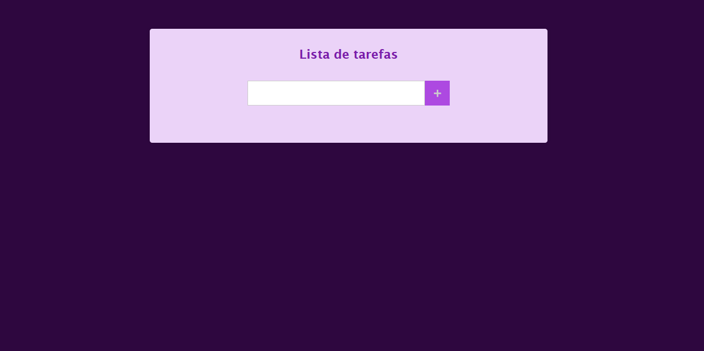

# Lista de tarefas

Veja o projeto [Clique aquip](https://lista-de-tarefas-six-orcin.vercel.app/).

## Available Scripts

;

Estou estudando através de cursos na EBAC, Dio e um pouco na Udemy, e resolvi fazer esse projeto aonde conseguimos fazer uma lista de tarefas e ao atualizar a pagina ou fechar o navegador, ele salva no localStorage.
